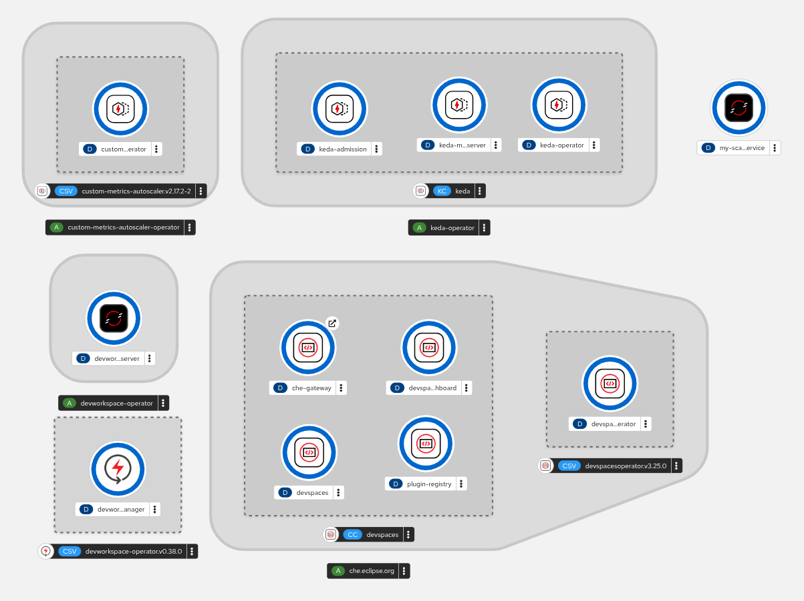
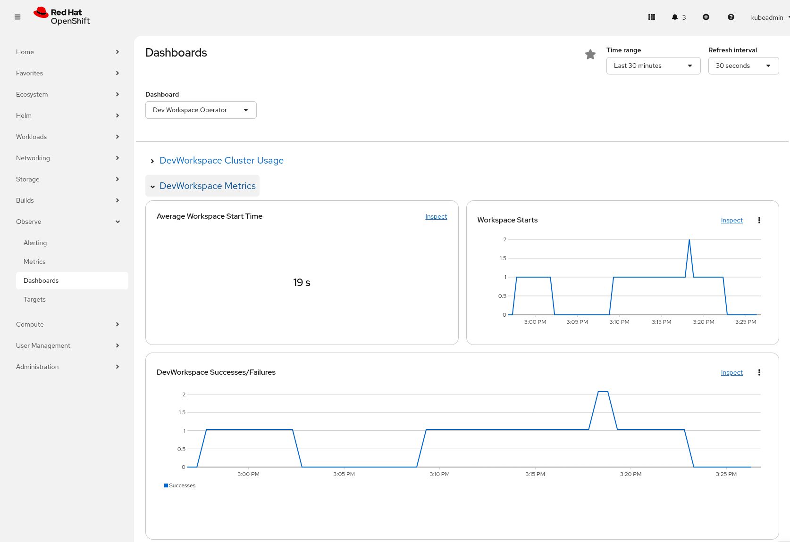

# Red Hat One - DevSpaces Autoscaling Example

## Introduction

This repository demonstrates how to orchestrate automatic scale up/down of services
in OpenShift based on the number of DevSpaces workspaces created and running.
The example showcases an **inverse scaling strategy** where:

- **0 running workspaces** → Service is scaled to **2 replicas**
- **1 running workspace** → Service is scaled to **1 replica**
- **2+ running workspaces** → Service is scaled to **0 replicas**

This approach maximizes cluster efficiency by dynamically adjusting resource allocation based
on developer workspace usage, ensuring that resources are available when developers need
them while freeing up capacity when workspaces are active.

## Architecture

The solution is built on the following components:



### Core Components

- **Red Hat DevSpaces Operator**: Provides cloud-native development environments (workspaces)
for teams. DevSpaces is based on Eclipse Che and enables developers to work in containerized,
consistent development environments.

- **Custom Metrics Autoscaler Operator (KEDA)**: An OpenShift operator that extends Kubernetes
Horizontal Pod Autoscaler (HPA) capabilities by enabling autoscaling based on custom metrics
from external systems like Prometheus. This operator is based on [KEDA (Kubernetes Event-Driven Autoscaling)](https://keda.sh/).

### How It Works

1. **Prometheus Metrics**: The system monitors the number of active DevSpaces workspaces
using Prometheus metrics exposed by the DevWorkspace Operator.

2. **KEDA ScaledObject**: A `ScaledObject` resource queries Prometheus using a PromQL query
to count active workspaces:

   ```promql
   count(kube_pod_labels{label_controller_devfile_io_creator!=""})
   ```

3. **Inverse Scaling Logic**: The ScaledObject implements an inverse scaling formula that
calculates the desired replica count based on workspace count.

4. **Automatic Scaling**: KEDA automatically adjusts the number of replicas of the target
deployment based on the metric values and thresholds configured.

### Namespace Organization

For demonstration and testing purposes, all resources are deployed in the `openshift-devspaces` namespace:

- DevSpaces Operator and instance
- Sample application deployment
- ScaledObject and related KEDA resources
- Service accounts and RBAC configurations

## Prerequisites

- **OpenShift Local (CRC)**: This example has been tested with the latest version of OpenShift Local (CodeReady Containers). Ensure you have CRC installed and running.

- **Cluster Admin Access**: Most of the setup commands require cluster administrator privileges.

- **OpenShift CLI (oc)**: The `oc` command-line tool must be installed and configured to access your cluster.

## Step-by-Step Guide

### Step 1: Install DevSpaces Operator

Apply the DevSpaces Operator configuration files:

```bash
oc apply -f devspaces/devspace.yaml
```

**Note**: Wait for the DevSpaces Operator to be fully installed before proceeding. You can check the installation status with:

```bash
oc get pods -n openshift-devspaces
```

Install a DevSpaces instance:

```bash
oc apply -f devspaces/devspaces-instance.yaml
```

Verify that Workspaces is available and there is a route to access it:

```bash
on 🎩 ❯ oc get route -n openshift-devspaces
NAME        HOST/PORT                    PATH   SERVICES      PORT   TERMINATION     WILDCARD
devspaces   devspaces.apps-crc.testing   /      che-gateway   8080   edge/Redirect   None
```

### Step 2: Install Custom Metrics Autoscaler Operator

Install the Custom Metrics Autoscaler Operator (KEDA):

```bash
oc apply -f autoscaler/custom-metrics-autoscaler-subscription.yaml
```

Wait for the operator to be installed and running:

```bash
oc get pods -n openshift-devspaces
```

### Step 3: Deploy Sample Application

Deploy the sample application that will be autoscaled:

```bash
oc apply -f autoscaler/deployment.yaml
```

This creates a deployment named `my-scaled-service` in the `openshift-devspaces` namespace.
The deployment starts with 0 replicas and will be automatically scaled by KEDA.

### Step 4: Configure Autoscaling with ScaledObject

Apply the `ScaledObject` configuration that defines the autoscaling behavior:

```bash
oc apply -f autoscaler/scaledobject.yaml
```

The ScaledObject is configured to:

- Monitor the number of active DevSpaces workspaces via Prometheus
- Scale the deployment between 0 and 2 replicas
- Use an inverse scaling formula: `2 - (number of running workspaces)`

### Step 5: Verify Autoscaling

Check the Horizontal Pod Autoscaler (HPA) created by KEDA:

```bash
oc get hpa -n openshift-devspaces
```

You should see an HPA named `keda-hpa-mi-app-escalador-inverso` managing the deployment.

**WARNING**: Collecting and checking metrics take time so it will take some minutes after
event to confirm the successful execution and outputs. If you are running this example in
a cloud environment, it could take shorter time compare with OpenShift Local.

1. **Initial State (0 workspaces)**: The deployment should scale to 2 replicas:

   ```bash
   on 🎩 ❯ oc get hpa -n openshift-devspaces
   NAME                              REFERENCE                      TARGETS     MINPODS   MAXPODS   REPLICAS   AGE
   keda-hpa-my-inversed-scaled-app   Deployment/my-scaled-service   1/1 (avg)   1         2         2          34s   
   ```

   Expected output: TARGETS should show 1/1 (avg), REPLICAS should be 2.

2. **After Creating 1 Workspace**: The deployment should scale down to 1 replica

   ```bash
   on 🎩 ❯ oc get hpa -n openshift-devspaces
   NAME                              REFERENCE                      TARGETS        MINPODS   MAXPODS   REPLICAS   AGE
   keda-hpa-my-inversed-scaled-app   Deployment/my-scaled-service   500m/1 (avg)   1         2         2          5m11s   
   ```

   Expected output: TARGETS should show 500m/1 (avg), REPLICAS should be 1

3. **After Creating 2 Workspaces**: The deployment should scale down to 0 replicas

   ```bash
   on 🎩 ❯ oc get hpa -n openshift-devspaces
   NAME                              REFERENCE                      TARGETS             MINPODS   MAXPODS   REPLICAS   AGE
   keda-hpa-my-inversed-scaled-app   Deployment/my-scaled-service   <unknown>/1 (avg)   1         2         0          15m
   ```

   Expected output: TARGETS should show 0/1 (avg), REPLICAS should be 0

### Step 6: Monitor Workspace Metrics

You can query Prometheus directly to see the number of active workspaces:

```promql
count(kube_pod_labels{label_controller_devfile_io_creator!=""}) or on() vector(0)
```

Or view the metrics in the OpenShift Console under the **Observe** → **Metrics** section.
Or view the metrics of Dev Spaces in the OpenShift Console Under the
**Observe** → **Dashboards** → **Dev Workspace Operator** section.




## Troubleshooting

### Check KEDA Operator Status

```bash
oc get pods -n openshift-devspaces
oc logs -n openshift-keda deployment/custom-metrics-autoscaler-operator
```

### Check ScaledObject Status

```bash
oc get scaledobject -n openshift-devspaces
oc describe scaledobject mi-app-escalador-inverso -n openshift-devspaces
```

### Verify Prometheus Access

Ensure the KEDA service account can access Prometheus:

```bash
oc get clusterrolebinding keda-prometheus-reader-final
```

### Check HPA Events

```bash
oc describe hpa keda-hpa-mi-app-escalador-inverso -n openshift-devspaces
```

## Additional Resources

- [Red Hat DevSpaces Documentation](https://access.redhat.com/documentation/en-us/red_hat_openshift_dev_spaces/)
- [KEDA Documentation](https://keda.sh/docs/)
- [Custom Metrics Autoscaler Operator](https://docs.openshift.com/container-platform/latest/nodes/clusters/nodes-cluster-autoscaling.html)
- [Prometheus Query Language (PromQL)](https://prometheus.io/docs/prometheus/latest/querying/basics/)
